# BasicExample

- [Observable 생성](#1observablecreate)

- [Subject](#2subject)

- [Observable 합성](#3observablesynthesis)

- [Error 처리](#4errorhandling)

- [Observable 변형](#5observabletransforming)

- [Observable Filter](#6observablefiltering)

- [Observable Utility](#7utility)

- [Observable Subscriptions](#8subscriptions)


## 1.ObservableCreate

> Observable는 안전한 형변환이 가능한 이벤트로 다른 종류의 데이터를 넣고 뺄 수 있다.

#### create

Observable를 만든다.

```swift
func createJust<E>(element: E) -> Observable<E> {
    return Observable.create { observer in
        observer.on(.next(element))
        observer.on(.completed)
        return Disposables.create()
    }
}
createJust(element: "Observable를 만들어 봅니다.")
    .subscribe { (event) in print(event) }
    .disposed(by: self.disposeBag)
```

#### just

just는 단일 이벤트를 발생하는 Observable를 생성한다.


```swift
Observable.just("RxSwift 빡세다 😭")
    .subscribe { (event: Event<String>) in print(event) }
    .disposed(by: self.disposeBag)
```

#### generate

조건식과 반복문을 가진 Observable 생성 함수이다.

```swift
Observable.generate(initialState: 1, condition: { $0 < 30 }, iterate: { $0 + 4 } )
    .subscribe(onNext: { (event) in print(event) })
    .disposed(by: self.disposeBag)
```

#### empty

empty는 이벤트가 없어 종료되는 Observable 함수이다.

```swift
Observable.empty()
    .subscribe(onNext: { event in print(event) })
    .disposed(by: self.disposeBag)
```

#### never

never는 종료되지 않는 Observable 함수이다.

```swift
Observable.never()
    .subscribe(onNext: { event in print(event) })
    .disposed(by: self.disposeBag)
```

#### error

error는 error을 리턴하며 종료되는 Observable 함수이다.

```swift
Observable.error(NSError(domain: "!!Error!!", code: 404, userInfo: nil) as Error)
    .subscribe(onNext: { event in print(event) })
    .disposed(by: self.disposeBag)
```

#### from

from은 순차적으로 이벤트를 발생시킨다.
array나 Sequence을 받아 순차적으로 이벤트를 발생시키는 Observable를 생성한다.


```swift
Observable.from([1, 3, 5, 7, 9, 10])
    .subscribe { (event) in print(event) }
    .disposed(by: self.disposeBag)

Observable.from([ "name": "Gwan Ho", "age": 28, "gender": "M" ])
    .subscribe { (event) in print(event) }
    .disposed(by: self.disposeBag)
```

#### of

Variadic을 받아 순차적으로 이벤트를 발생시키는 Observable를 생성한다.


```swift
Observable.of("가", "나", "다", "라")
    .subscribe { (event) in print(event) }
    .disposed(by: self.disposeBag)
```

#### deferred

lazy initialze Observable 생성자. subscribe가 발생할때 Observable이 생성된다.


```swift
Observable.deferred({ Observable.just("RxSwift deferred 테스트") })
    .subscribe { (event) in print(event) }
    .disposed(by: self.disposeBag)
```

#### repeatElement

설장한 element를 반복적으로 이벤트를 발생한다.

```swift
Observable.repeatElement("repeat test")
    .subscribe { (event) in print(event) }
    .disposed(by: self.disposeBag)
```

#### range

설정한 Range내의 이벤트를 발생한다.

```swift
Observable.range(start: 10, count: 20)
    .subscribe { (event) in print(event) }
    .disposed(by: self.disposeBag)
```


## 2.Subject

> Subject는 Imperative eventing로 어떤 이벤트를 발생 하고 싶을때. 얼마나 많은 객체에게 그 이벤트를 구독하는지 중요하지 않다. 원하는 이벤트를 subscription(observer) 존재 여부와 관계없이 이벤트를 발행 할 수 있다.

#### AsyncSubject

Complete 될때까지 이벤트는 발생되지 않으며, complete가 되면 마지막 이벤트를 발생하고 종료된다.


에러로 종료되면 마지막 이벤트 전달 없이 에러만 발생한다.


```swift
let asyncSubject = AsyncSubject<Int>()
asyncSubject
    .subscribe({ print($0) })
    .disposed(by: self.disposeBag)

asyncSubject.on(.next(1))
asyncSubject.on(.next(2))
asyncSubject.on(.next(3)) // 마지막 이벤트
asyncSubject.on(.completed)
//asyncSubject.on(.error(NSError(domain: "err", code: 404, userInfo: nil)))
// 에러로 종료되면 마지막 이벤트 전달 없이 에러만 발생한다.
```

#### PublishSubject


소스 Observable이 오류 때문에 종료되면 아무런 항목도 배출하지 않고 소스 Observable에서 발생한 오류를 그대로 전달한다.


subscribe 된 시점 이후부터 발생한 이벤트를 전달한다. subscribe 되기 이전의 이번트는 전달하지 않는다.

```swift
let publishSubject = PublishSubject<String>()
publishSubject.onNext("publish 1")
publishSubject
    .subscribe({ print("1_\($0)") })
    .disposed(by: self.disposeBag)
publishSubject.onNext("publish 2")
publishSubject.onNext("publish 3")
publishSubject
    .subscribe({ print("2_\($0)") })
    .disposed(by: self.disposeBag)
publishSubject.onNext("publish 4")
publishSubject.onNext("publish 5")
```

#### BehaviorSubject

초기값을 지닌 subject이다. subscribe가 발생하면 현재 저장된 값을 이벤트로 전달하고 마지막 이벤트값을 저장하고 있다.


오류 때문에 종료되면 BehaviorSubject는 아무런 항목도 배출하지 않고 소스 Observable에서 발생한 오류를 그대로 전달한다.


```swift
let behaviorSubject = BehaviorSubject<String>(value: "behavior init")
behaviorSubject
    .subscribe({ print($0) })
    .disposed(by: self.disposeBag)
behaviorSubject.onNext("behavior 1")
behaviorSubject.onNext("behavior 2")
behaviorSubject
    .subscribe({ print($0) })
    .disposed(by: self.disposeBag)
behaviorSubject.onNext("behavior 3")
behaviorSubject.onNext("behavior 4")
```

#### ReplaySubject

n개의 이벤트를 저장하고 subscribe되는 시점과 상관없이 저장된 모든 이벤트를 전달한다.


```swift
let replaySubject = ReplaySubject<String>.create(bufferSize: 3) // createUnbounded() 모든 이벤트가 전달된다.
replaySubject.onNext("replay 1")
replaySubject.onNext("replay 2")
replaySubject.onNext("replay 3")
replaySubject.onNext("replay 4")
replaySubject
    .subscribe({ print($0) })
    .disposed(by: self.disposeBag)
replaySubject.onNext("replay 5")
replaySubject.onNext("replay 6")
replaySubject.onNext("replay 7")
```

## 3.ObservableSynthesis

> Observable의 결합은 연결고리가 있느 몇가지 이벤트들을 같이 처리해야 할때 사용할수 있다.

#### combineLatest

두 Observable 의 각각의 이벤트가 발생할 때 두 Observable의 마지막 이벤트들을 묶어서 전달한다. 두 이벤트의 타입은 달라도 된다.


```swift
let combineFirst = Observable.from(["1", "2", "3"])
let combineSecond = Observable.from(["A", "B", "C", "D"])
Observable.combineLatest(combineFirst, combineSecond) { (first, second) in
    return (first, second)
    }.subscribe({ print("combineLatest \($0)") })
    .disposed(by: self.disposeBag)
```

```swift
combineLatest next(("1", "A"))
combineLatest next(("2", "A"))
combineLatest next(("2", "B"))
combineLatest next(("3", "B"))
combineLatest next(("3", "C"))
combineLatest next(("3", "D"))
combineLatest completed
```

#### withLatestFrom

두개의 Observable 을 합성하지만, 한쪽 Observable의 이벤트가 발생할때에 합성해주는 메서드이다. 합성할 다른쪽 이벤트가 없다면 이벤트는 스킵된다.


```swift
let latestFromFirst = Observable<Int>.interval(2, scheduler: MainScheduler.instance).take(6)
    .map{ ["A", "B", "C", "", "", "D"][$0] }
    .filter{ !$0.isEmpty }

Observable<Int>.interval(1, scheduler: MainScheduler.instance)
    .take(12)
    .map({ "\($0)" })
    .withLatestFrom(latestFromFirst, resultSelector: { (first, second) in
        return (first, second)
    }).subscribe({ print($0) })
    .disposed(by: self.disposeBag)
```

```swift
next(("1", "A"))
next(("2", "A"))
next(("3", "B"))
next(("4", "B"))
next(("5", "C"))
next(("6", "C"))
next(("7", "C"))
next(("8", "C"))
next(("9", "C"))
next(("10", "C"))
next(("11", "D"))
completed
```

#### merge

merge는 같은 타입의 이벤트를 발생하는 Observable을 합성하는 함수이며, 각각의 이벤트를 모두 수신할 수 있다.


```swift
let mergeFirst = Observable<Int>.interval(1, scheduler: MainScheduler.instance).take(3)
    .map({ "mergeFirst: \($0)" })
let mergeSecond = Observable<Int>.interval(2, scheduler: MainScheduler.instance).take(2)
    .map({ "mergeSecond: \($0)" })
Observable.of(mergeFirst, mergeSecond).merge().subscribe { event in
    print(event)
    }.disposed(by: self.disposeBag)
```

```swift
next(mergeFirst: 0)
next(mergeFirst: 1)
next(mergeSecond: 0)
next(mergeFirst: 2)
next(mergeSecond: 1)
completed
```

#### switchLatest

switchLatest는 observable을 switch 할 수 있는 observable이다.
이벤트를 수신하고 싶은 observable로 바꾸면 해당 이벤트가 발생하는 것을 수신할 수 있다.


```swift
let first = PublishSubject<String>()
let second = PublishSubject<String>()
let switchTest = BehaviorSubject<Observable<String>>(value: first)
switchTest.switchLatest().subscribe { (event) in
    print(event)
    }.disposed(by: self.disposeBag)
first.onNext("A1")
second.onNext("B1")
switchTest.onNext(second)
first.onNext("A2")
second.onNext("B2")
second.onNext("B3")
first.onNext("A3")
first.onNext("A4")
second.onNext("B4")
second.onNext("B5")
```

```swift
next(A1)
next(B2)
next(B3)
next(B4)
next(B5)
```


#### zip

zip으로 두개의 Observable를 합친다.


```swift
Observable.zip(Observable.from([1, 2, 3, 4]), Observable.of("A", "B", "C")) { (first, second) in
    return "\(first)\(second)"
    }.subscribe({ print($0) })
    .disposed(by: self.disposeBag)
```

```swift
next(1A)
next(2B)
next(3C)
completed
```

#### concat

두개 이상의 Observable를 직렬로 연결한다. 하나의 Observable가 이벤트를 전달 완료 후 그 다음 Observable의 이벤트를 전달한다.


```swift
Observable<Int>.interval(1, scheduler: MainScheduler.instance)
    .map{ "first: \($0)" }
    .take(3)
    .concat(Observable<Int>.interval(0.5, scheduler: MainScheduler.instance).map{ "second: \($0)" }.take(4))
    .subscribe({ print($0) })
    .disposed(by: self.disposeBag)
```

```swift
next(first: 0)
next(first: 1)
next(first: 2)
next(second: 0)
next(second: 1)
next(second: 2)
next(second: 3)
completed
```

#### amb

맨 먼저발생한 Observable의 이벤트만을 사용한다.


```swift
let first = Observable<Int>.interval(1, scheduler: MainScheduler.instance)
    .map{ "first: \($0)" }
    .take(3)
let second = Observable<Int>.interval(0.5, scheduler: MainScheduler.instance)
    .map{ "second: \($0)" }
    .take(3)
let third = Observable<Int>.interval(1.1, scheduler: MainScheduler.instance)
    .map{ "third: \($0)" }
    .take(3)
first.amb(second).amb(third)
    .subscribe({ print($0) })
    .disposed(by: self.disposeBag)
```

```swift
next(second: 0)
next(second: 1)
next(second: 2)
completed
```

#### startWith

처음 이벤트를 넣어줄 수 있다.


```swift
Observable.from([1, 2, 3, 4, 5])
    .startWith(9, 8, 7)
    .subscribe({ print($0) })
    .disposed(by: self.disposeBag)
```

```swift
next(9)
next(8)
next(7)
next(1)
next(2)
next(3)
next(4)
next(5)
completed
```

## 4.ErrorHandling

> Error이 났을때 감지하는 catchError 메서드와 다시 시도하는 retry, 일정 시간동안 이벤트가 오지 않으면 timerout을 할수있다.


#### catchError

에러가 발생되었을때 onError로 종료되지 않고 이벤트를 발생하고 onComplete 될수 있게 한다


```swift
Observable<String>.create{ observer in
    for count in 1...3 {
        observer.onNext("\(count)")
    }
    observer.onError(NSError(domain: "error!", code: 404, userInfo: nil))
    return Disposables.create {
        print("dispose!")
    }
}.catchError { (error) -> Observable<String> in
    return Observable.of("close1", "close2")
}.subscribe({ print($0) })
.disposed(by: self.disposeBag)
```

```swift
next(1)
next(2)
next(3)
dispose!
next(close1)
next(close2)
completed
```

#### catchErrorJustReturn

subscribe에서 에러를 감지하는 것이 아닌, Observable에서 에러에 대한 기본 이벤트를 설정한다.

```swift
Observable<String>.create{ observer in
    [1, 2, 3].forEach({ observer.on(.next("\($0)")) })
    observer.on(.error(NSError(domain: "error!", code: 404, userInfo: nil)))
    return Disposables.create {
        print("dispose!")
    }
}.catchErrorJustReturn("End")
.subscribe({ print($0) })
.disposed(by: self.disposeBag)
```

```swift
next(1)
next(2)
next(3)
next(End)
completed
dispose!
```

#### retry

에러가 발생했을때 성공을 기대하며 Observable을 다시 시도한다. maxAttemptCount를 통해 재시도 횟수를 지정한다. 2를 주면 재시도를 1번 한다.


```swift
var isFirst = true
Observable<String>.create { observer in
    observer.onNext("1")
    observer.onNext("2")
    if isFirst {
        observer.onError(NSError(domain: "Error!", code: 404, userInfo: nil))
    } else {
        observer.on(.completed)
    }
    isFirst = false
    return Disposables.create()
}.retry(2)
.subscribe({ print($0) })
.disposed(by: self.disposeBag)
```

```swift
next(1)
next(2)
next(1)
next(2)
completed
```

#### retryWhen

retry 하는 시점을 지정할수 있다. 재시도는 한번만 수행한다.

```swift
Observable<String>.create { observer in
    observer.on(.next("1"))
    observer.on(.next("2"))
    observer.onError(NSError(domain: "Error!", code: 404, userInfo: nil))
    return Disposables.create()
}.retryWhen { (_) -> Observable<Int> in
    return Observable<Int>.timer(3, scheduler: MainScheduler.asyncInstance)
}.subscribe({ print($0) })
.disposed(by: self.disposeBag)
```

```swift
next(1)
next(2)

next(1)
next(2)
completed
```

#### timeout

이벤트가 일정시간동안 발생하지 않으면 오류를 발생시킨다.


```swift
Observable<Int>.create { observer in
    let timer = DispatchSource.makeTimerSource(queue: DispatchQueue.global())
    timer.schedule(deadline: .now() + 1, repeating: 1)
    let cancel = Disposables.create {
        timer.cancel()
    }
    var next = 0
    timer.setEventHandler(handler: {
        if cancel.isDisposed { return }
        if next < 3 {
            observer.onNext(next)
            next += 1
        }
    })
    timer.resume()
    return cancel
    }.timeout(2, scheduler: MainScheduler.instance)
    .subscribe({ print($0) })
    .disposed(by: self.disposeBag)
```

```swift
next(0)
next(1)
next(2)
error(Sequence timeout.)
```


## 5.ObservableTransforming

> Observable의 이벤트 타입을 변경하거나, 새로운 모델로 가공하거나 변형할때 사용하는 메서드


#### buffer

이벤트에 버퍼를 저장한 뒤 묶어서 방출
timeSpan: 버퍼에 저장되는 시간간격
count: 버퍼에 저장되는 최대 이벤트의 갯수

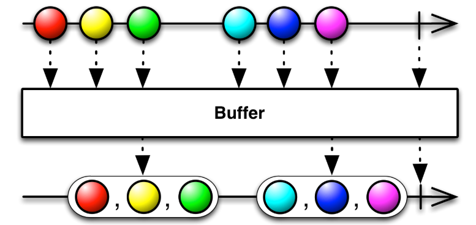

```swift
Observable<Int>.interval(1, scheduler: MainScheduler.instance).map{ "buffer: \($0)" }.take(7)
    .buffer(timeSpan: 2.5, count: 3, scheduler: MainScheduler.instance)
    .subscribe { event in print(event) }
    .disposed(by: self.disposeBag)
```

```swift
next(["buffer: 0", "buffer: 1"])
next(["buffer: 2", "buffer: 3", "buffer: 4"])
next(["buffer: 5", "buffer: 6"])
completed
```

#### flatMap

원본 Observable의 이벤트를 받아 새로운 Observable로 변형한다.

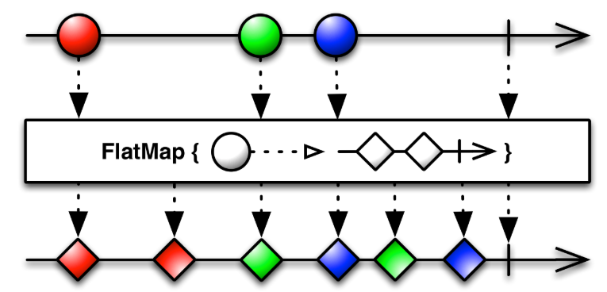

```swift
Observable<Int>.interval(1, scheduler: MainScheduler.instance).take(2)
    .flatMap({ (num) -> Observable<String> in
        return Observable<String>.create { observer in
            observer.onNext("A\(num)")
            observer.onNext("B\(num)")
            return Disposables.create {
                print("dispose")
            }
        }
    }).subscribe { print($0) }
    .disposed(by: self.disposeBag)
```

```swift
next(A0)
next(B0)
next(A1)
next(B1)
```


#### scan

값을 축적해서 가지고 있을 수 있으며, 이 값을 통해 이벤트를 변형할 수 있는 메서드이다.

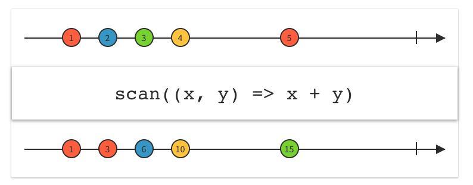

```swift
Observable<Int>.interval(1, scheduler: MainScheduler.instance).take(5)
    .scan(10, accumulator: { (accumulator, num) -> Int in
        return accumulator + num
    })
    .delaySubscription(3, scheduler: MainScheduler.instance)
    .subscribe { print($0) }
    .disposed(by: self.disposeBag)
```

```swift
next(10)
next(11)
next(13)
next(16)
next(20)
completed
```

#### window

buffer와 유사하지만 모여진 이벤트로 새로운 observable를 생성한다.

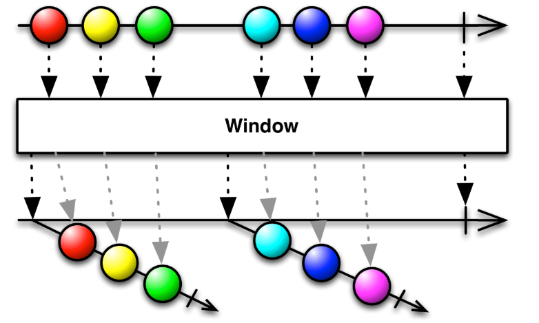

```swift
Observable<Int>.of(1, 2, 3, 4, 5, 6, 7)
    .window(timeSpan: 3, count: 3, scheduler: MainScheduler.instance)
    .subscribe(onNext: { observable in
        print(observable)
        observable.subscribe(onNext: { event in
        print(event)
    }).disposed(by: self.disposeBag)
}).disposed(by: self.disposeBag)
```

```swift
RxSwift.AddRef<Swift.Int>
1
2
3
RxSwift.AddRef<Swift.Int>
4
5
6
RxSwift.AddRef<Swift.Int>
7
```

#### reduce

기본값을 가지고, emit된 값들을 연산해서 하나의 결과값 이벤트를 발생하는 Observable 로 변형한다.

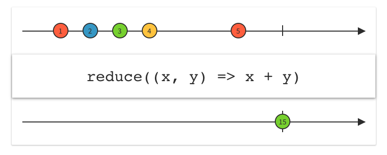

```swift
Observable<Int>.range(start: 0, count: 10)
    .reduce(100, accumulator: +)
    .subscribe { print($0) }
    .disposed(by: self.disposeBag)
```

```swift
next(145)
completed
```

#### groupBy

이벤트들을 분류해서 key 값을 통해 다른 Observable로 변형 할 수 있다. keySelector에서 각 요소들에의 키값을 추출하는 함수를 전달한다.

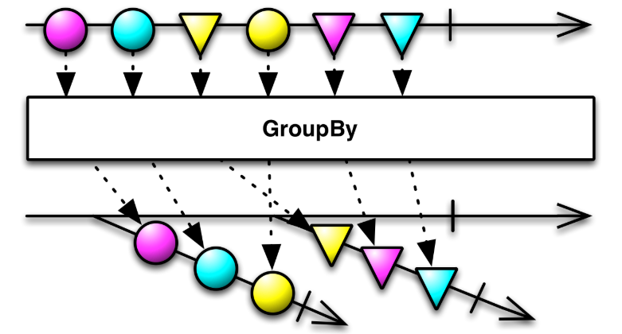

```swift
Observable.of(1,2,3,4,5,5,5)
    .groupBy { (value) -> Bool in
        return value % 2 == 0
    }.flatMap { grouped -> Observable<String> in
        if grouped.key {
            return grouped.map { "even: \($0)" }
        } else {
            return grouped.map { "odd: \($0)" }
        }
    }.subscribe { print($0) }
.disposed(by: self.disposeBag)
```

```swift
next(odd: 1)
next(even: 2)
next(odd: 3)
next(even: 4)
next(odd: 5)
next(odd: 5)
next(odd: 5)
completed
```


## 6.ObservableFiltering

> Observable이 특정조건을 충족할때 발생하는 메서드


#### debounce

지정한 시간간격 내에 하나의 이벤트만 발생했을때 이벤트를 전달한다.
이벤트가 발생한후 debounce 시간동안 다른 이벤트가 발생하지 않으면 debounce된 Observable 에 이벤트가 발생한다.
이벤트가 발생한후 debounce 시간동안 다른 이벤트가 발생하면 debounce된 Observable 에 이벤트가 발생하지 않는다.

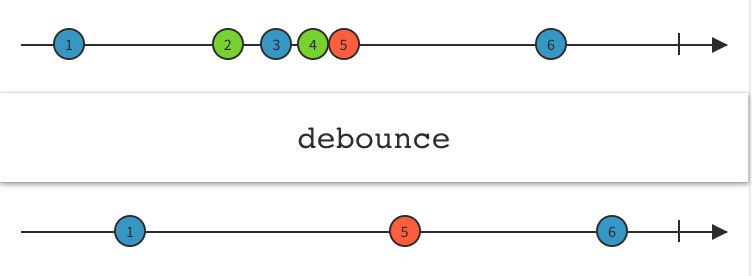

```swift
Observable<Int>.interval(0.6, scheduler: MainScheduler.instance).take(3, scheduler: MainScheduler.instance)
    .debounce(0.5, scheduler: MainScheduler.instance)
    .subscribe { print($0) }
    .disposed(by: self.disposeBag)
```

#### throttle

지정한 시간 내에 발생한 최초 이벤트 및 가장 최신의 이벤트를 발생시킨다.


```swift
Observable<Int>.interval(0.1, scheduler: MainScheduler.instance).take(20)
    .throttle(1, scheduler: MainScheduler.instance)
    .subscribe { print($0) }
    .disposed(by: self.disposeBag)
```


#### distinct

이전 이벤트와 비교해서 값이 다를 경우에만 이벤트를 방출한다.

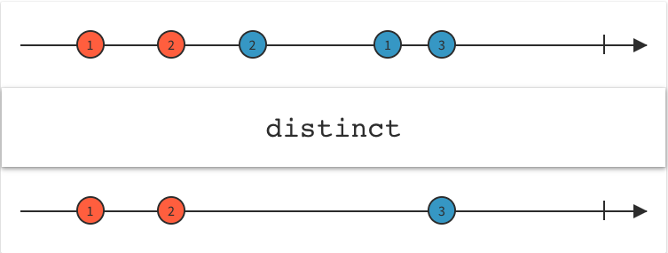

```swift
let array = ["가", "나", "가", "가", "가", "바", "나", "나", "나", "다", "나", "나"]
Observable<Int>.interval(0.1, scheduler: MainScheduler.instance).take(array.count)
    .enumerated().map({ array[$0.index] })
    .throttle(0.2, scheduler: MainScheduler.instance)
    .distinctUntilChanged()
    .subscribe { print($0) }
    .disposed(by: self.disposeBag)
```


#### elementAt

지정한 index의 이벤트만 발생시킨다.

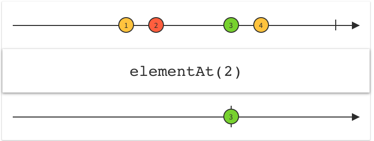

```swift
Observable.of(1, 2, 3, 3, 7, 10, 1).elementAt(4)
    .subscribe { print($0) }
    .disposed(by: self.disposeBag)
```


#### single

첫번째 이벤트만 발생시킨다.

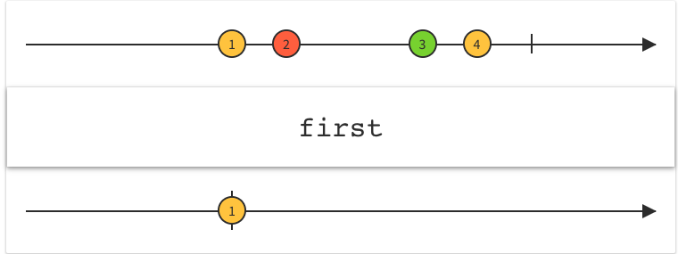

```swift
Observable.of(1, 2, 3, 3, 7, 10, 1).single()
    .subscribe { print($0) }
    .disposed(by: self.disposeBag)
```

#### sample

sampler observable의 이벤트에 따라 본래 observable의 이벤트가 전달된다. 전달할 이벤트가 없을때는 무시한다.

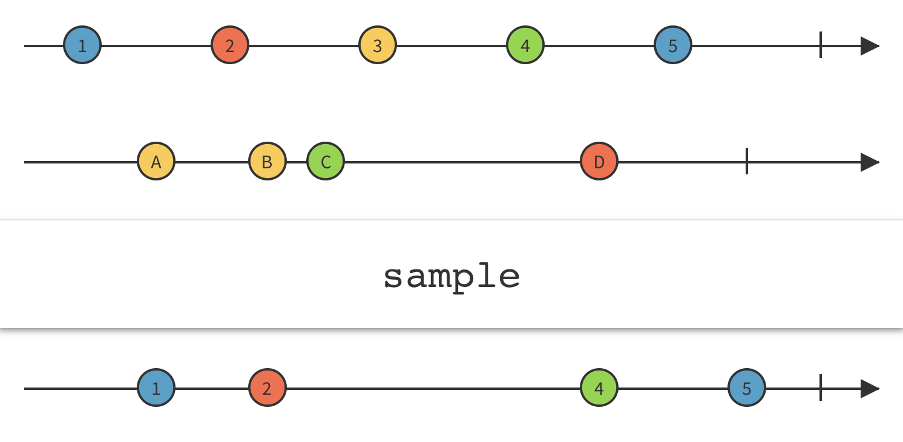

```swift
Observable<Int>.interval(0.1, scheduler: MainScheduler.instance).take(10)
    .sample(Observable<Int>.interval(0.5, scheduler: MainScheduler.instance))
    .subscribe { print($0) }
    .disposed(by: self.disposeBag)
```


#### skip

이벤트를 스킵한다.

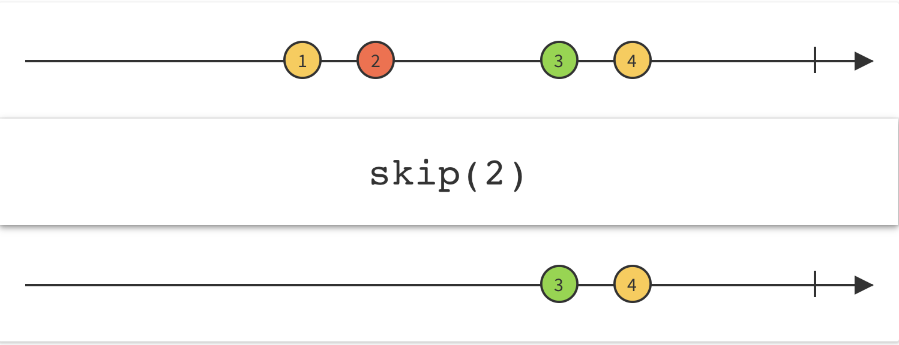

```swift
Observable.of(1,2,3,4,5,6)
    .skip(5)
    .subscribe { print($0) }
    .disposed(by: self.disposeBag)

Observable.of(1,2,3,4,5,6)
    .skipWhile { $0 != 5 }
    .subscribe { print($0) }
    .disposed(by: self.disposeBag)
```

#### ignoreElements

모든 이벤트를 무시한다

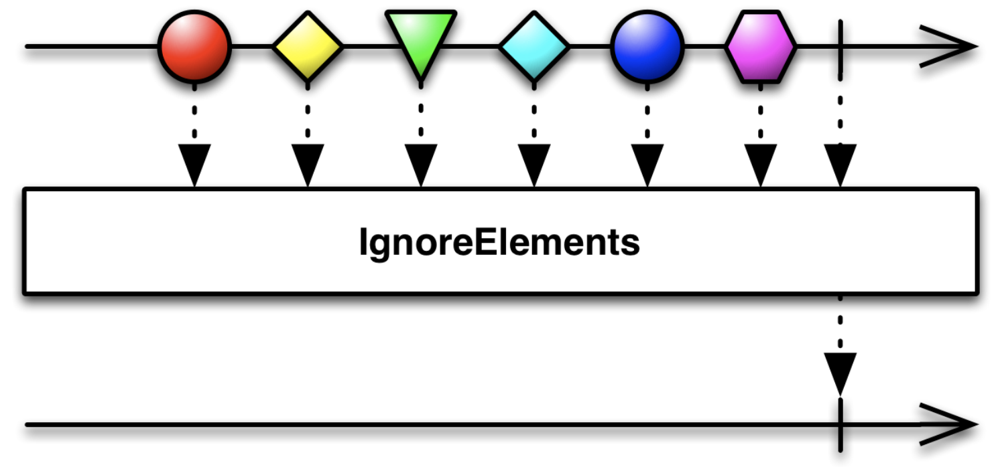

```swift
Observable.of(1,2,3,4,5)
    .ignoreElements()
    .subscribe()
    .disposed(by: self.disposeBag)
```


## 7.Utility

> 여러 이벤트 메서드 관련 utility 함수


#### doOn

Observable의 이벤트가 발생할때 이벤트 핸들러
subscribe시점이 아닌 이벤트 발생시점

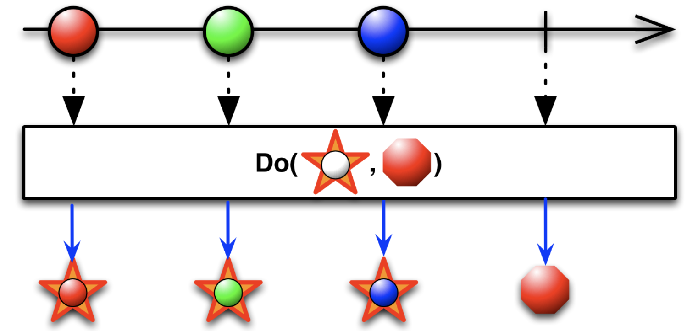

```swift
Observable<Int>.interval(0.1, scheduler: MainScheduler.instance)
    .take(10)
    .do(onNext: {event in
        print("do: \(event)")
        })
    .subscribe({ print($0) })
    .disposed(by: self.disposeBag)
```

#### observeOn

ObserveOn 이 호출된 다음 메서드가 수행될 스케쥴러를 지정할수 있다.

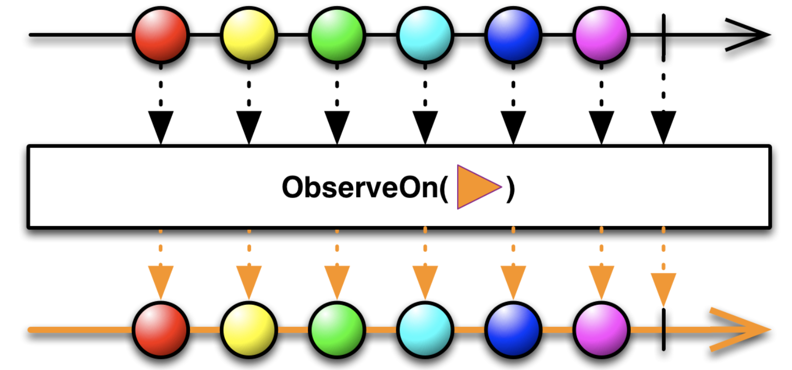

```swift
Observable<Int>.interval(0.1, scheduler: MainScheduler.instance)
    .take(10)
    .observeOn(MainScheduler.instance)
    .do(onNext: { print("do: \(Thread.isMainThread), \($0)") })
    .observeOn(ConcurrentDispatchQueueScheduler.init(qos: .background))
    .subscribe { print("subscribe: \(Thread.isMainThread), \($0)") }
    .disposed(by: self.disposeBag)
```

#### subscribeOn

Observable이 수행될 스케쥴러를 지정한다. create 블럭 안에서의 스케쥴러를 지정할수 있다.


```swift
Observable<String>.create { observer in
    let eventText = "create: \(Thread.isMainThread)"
    print(eventText)
    observer.onNext(eventText)
    return Disposables.create()
}.subscribeOn(ConcurrentDispatchQueueScheduler(qos: .background))
    .map { value -> String in
        let eventText = "map: \(Thread.isMainThread)"
        print(eventText)
        return eventText
    }
    .asDriver(onErrorJustReturn: "-1")
    .asObservable()
    .do(onNext: { value in
        print("do: \(Thread.isMainThread)")
    })
    .subscribe {  (value) in
        print("subscribe: \(Thread.isMainThread)")
    }.disposed(by: self.disposeBag)
    
/*
    .asDriver(onErrorJustReturn: "-1")
    .asObservable()
    는
    .observeOn(MainScheduler.instance)
    .catchErrorJustReturn("-1")
    .shareReplayLatesWhileConnected()
    와 동일하다.
*/
```


#### materialize

materialize: 이벤트가 전달될때 어떤 이벤트인지도 같이 전달된다.
dematerialize: materialize된 이벤트를 다시 일반 이벤트발생형태로 변경한다.

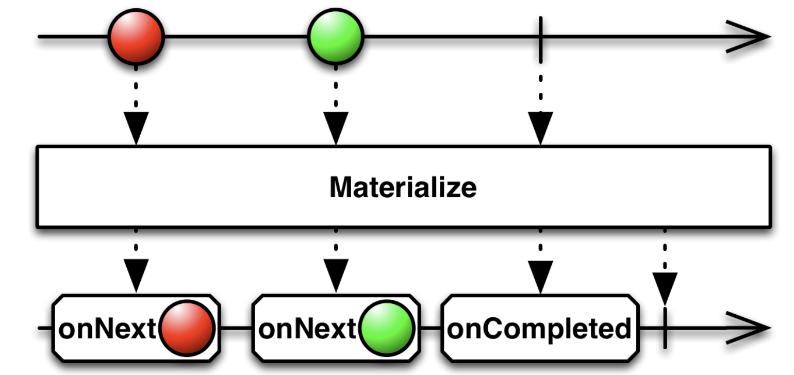
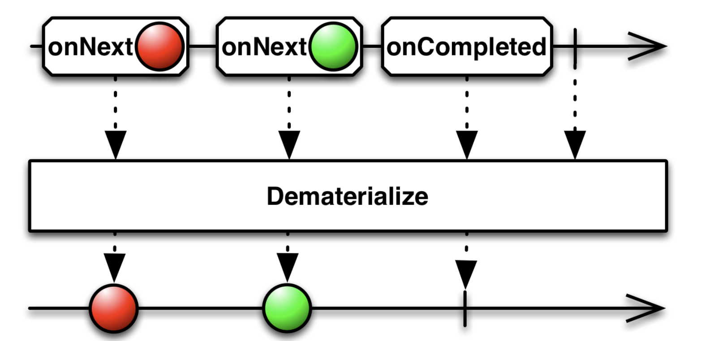

```swift
Observable<Int>.interval(1, scheduler: MainScheduler.instance).take(4)
    .materialize()
    .dematerialize()
    .subscribe { print($0) }
    .disposed(by: self.disposeBag)
```

#### using

Observable과 동일한 수명을 가진 일회용 리소스를 만듭니다.

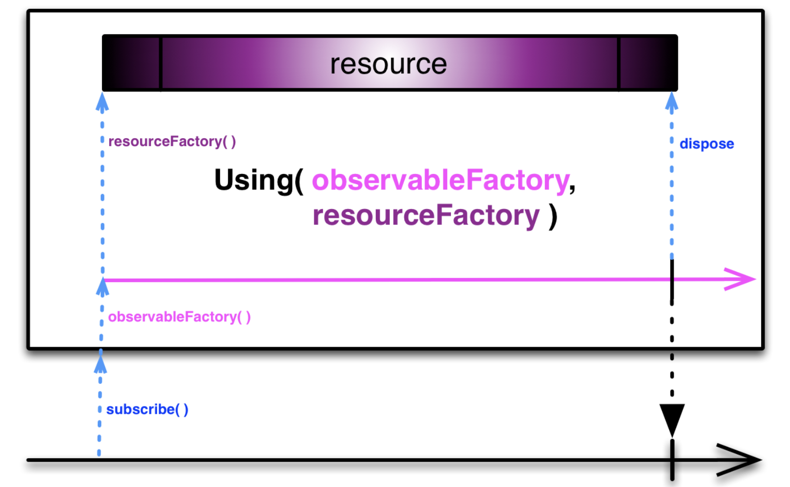

```swift
class ResourceDisposable: Disposable {
    func dispose() {
        print("dispose!")
    }
}
Observable.using({ () -> ResourceDisposable in
    return ResourceDisposable()
}) { disposable in
    return Observable<Int>.interval(1, scheduler: MainScheduler.instance)
}.take(3)
.subscribe { print($0) }
.disposed(by: self.disposeBag)
```


## 8.Subscriptions

> Cold Observable는 subscribe부터 Observable 이 이벤트를 발생시키기 시작을 한다. 두번 subscribe가 일어나면 두개의 이벤트 스트림이 발생한다.
> 하나의 이벤트 스트림을 두개의 subscribe에 공유할때 메서드이다.


#### multicast

Observable의 시컨스를 하나의 subject를 통해 multicast로 이벤트를 전달하게 된다.
connect 하기 전에는 시컨스가 시작되지 않는다.

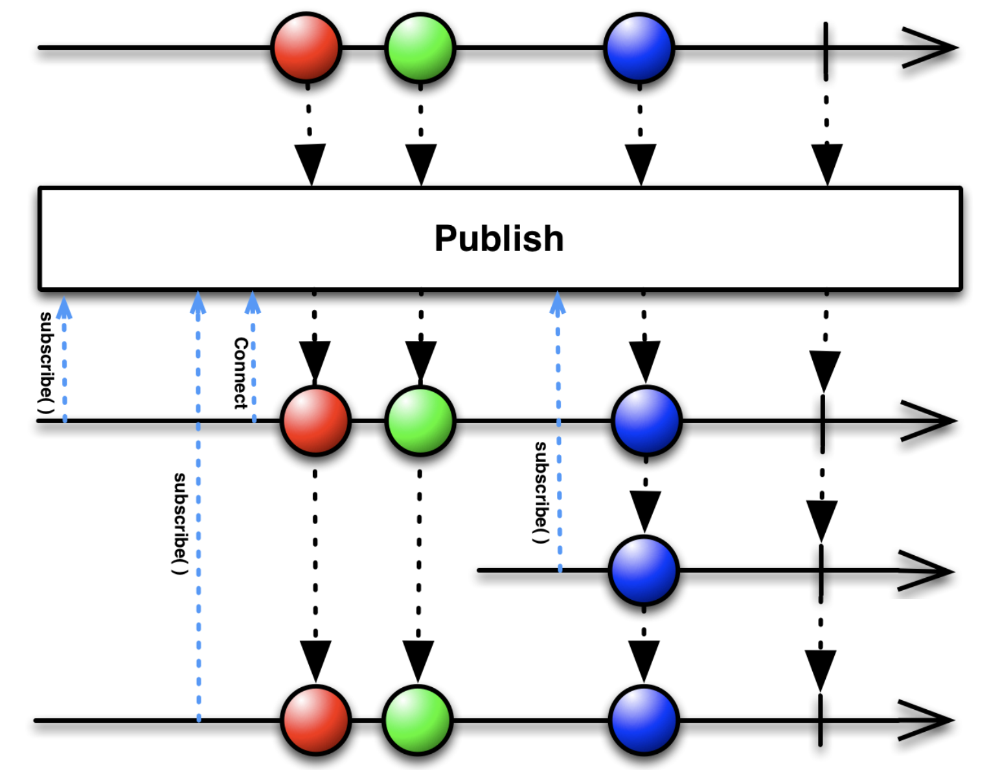

```swift
let timer = Observable<Int>.interval(1, scheduler: MainScheduler.instance).take(4)
let subject = PublishSubject<Int>()
let multicast = timer.multicast(subject)
_ = multicast.connect()
multicast.subscribe { event in
    print("first scription: \(event)")
}.disposed(by: self.disposeBag)

multicast.delaySubscription(2, scheduler: MainScheduler.instance)
    .subscribe { event in
        print("second scription: \(event)")
    }.disposed(by: self.disposeBag)
    
// multicase + publish subject 합쳐서 publish로 할수 있다.
let publish = Observable<Int>.interval(1, scheduler: MainScheduler.instance)
    .take(4)
    .publish()
_ = publish.connect()
publish.subscribe { print("first: \($0)") }
    .disposed(by: self.disposeBag)
publish.delaySubscription(1, scheduler: MainScheduler.instance)
    .subscribe{ print("second: \($0)") }
    .disposed(by: self.disposeBag)
```

#### replay

subscriptions을 공유시 지정한 버퍼 크기만큼 이벤트를 저장하고 전달해준다.
replayAll은 모든 이벤트를 저장한다.

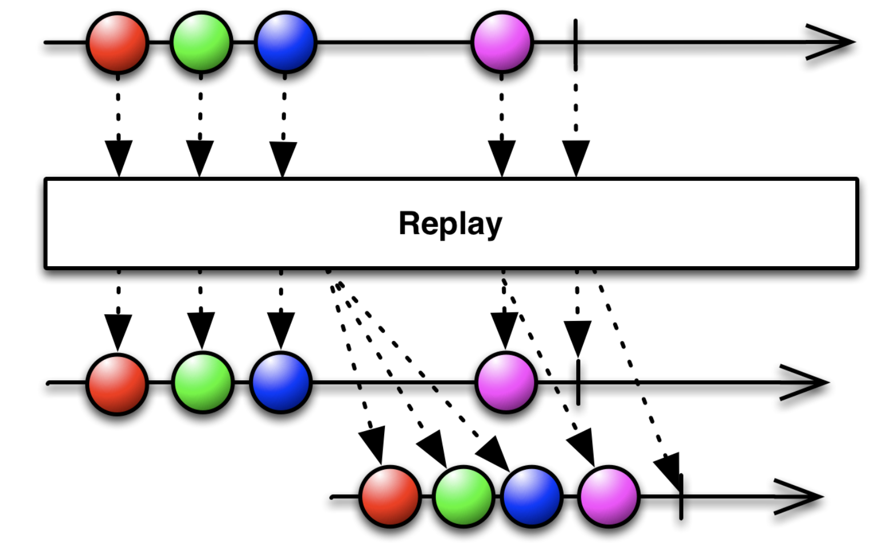

```swift
let timer = Observable<Int>.interval(1, scheduler: MainScheduler.instance).take(5)
let replay = timer.replay(2)
_ = replay.connect()
replay.subscribe { print("first: \($0)") }
    .disposed(by: self.disposeBag)
replay.delaySubscription(4, scheduler: MainScheduler.instance)
    .subscribe { print("second: \($0)") }
    .disposed(by: self.disposeBag)
```

#### share

간단하게 공유를 만들수 있다. subscribe가 더 이상 없을때까지 지속되고 계속적으로 subscription을 공유할 수 있다.

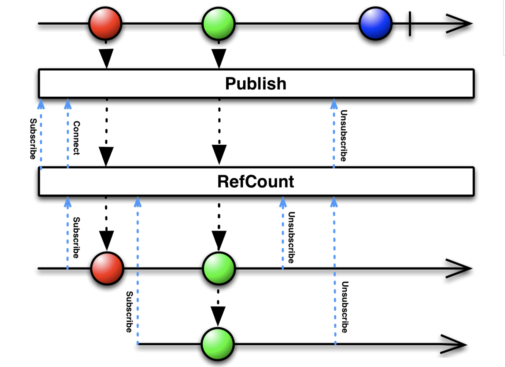

```swift
let timer = Observable<Int>.interval(1, scheduler: MainScheduler.instance).take(5)
let share = timer.share()
share.subscribe { print("first: \($0)") }
    .disposed(by: self.disposeBag)
share.delaySubscription(4, scheduler: MainScheduler.instance)
    .subscribe { print("second: \($0)") }
    .disposed(by: self.disposeBag)
```


참고 블로그<br/>
[RxSwift 알아보기](https://brunch.co.kr/@tilltue)
