# BasicExample

* [Observable 생성](##1.ObservableCreate)

* [Subject](## 2.Subject)

* [Observable 합성](#3.ObservableSynthesis)

* [Error 처리](# 4.ErrorHandling)

## 1.ObservableCreate

> Observable는 안전한 형변환이 가능한 이벤트로 다른 종류의 데이터를 넣고 뺄 수 있다.

#### create

Observable를 만든다.

```swift
func createJust<E>(element: E) -> Observable<E> {
    return Observable.create { observer in
        observer.on(.next(element))
        observer.on(.completed)
        return Disposables.create()
    }
}
createJust(element: "Observable를 만들어 봅니다.")
    .subscribe { (event) in print(event) }
    .disposed(by: self.disposeBag)
```

#### just

just는 단일 이벤트를 발생하는 Observable를 생성한다.

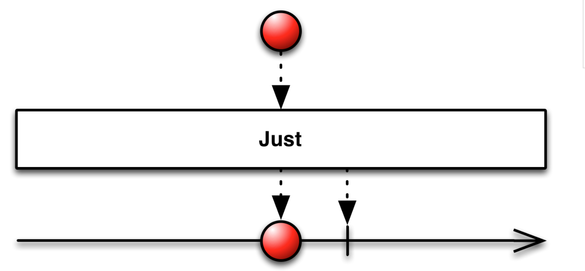

```swift
Observable.just("RxSwift 빡세다 😭")
    .subscribe { (event: Event<String>) in print(event) }
    .disposed(by: self.disposeBag)
```

#### generate

조건식과 반복문을 가진 Observable 생성 함수이다.

```swift
Observable.generate(initialState: 1, condition: { $0 < 30 }, iterate: { $0 + 4 } )
    .subscribe(onNext: { (event) in print(event) })
    .disposed(by: self.disposeBag)
```

#### empty

empty는 이벤트가 없어 종료되는 Observable 함수이다.

```swift
Observable.empty()
    .subscribe(onNext: { event in print(event) })
    .disposed(by: self.disposeBag)
```

#### never

never는 종료되지 않는 Observable 함수이다.

```swift
Observable.never()
    .subscribe(onNext: { event in print(event) })
    .disposed(by: self.disposeBag)
```

#### error

error는 error을 리턴하며 종료되는 Observable 함수이다.

```swift
Observable.error(NSError(domain: "!!Error!!", code: 404, userInfo: nil) as Error)
    .subscribe(onNext: { event in print(event) })
    .disposed(by: self.disposeBag)
```

#### from

from은 순차적으로 이벤트를 발생시킨다.
array나 Sequence을 받아 순차적으로 이벤트를 발생시키는 Observable를 생성한다.

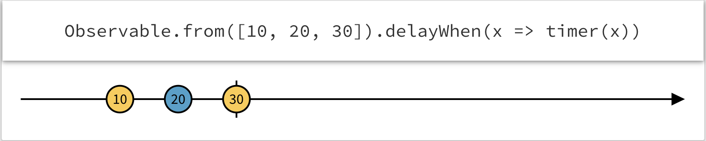

```swift
Observable.from([1, 3, 5, 7, 9, 10])
    .subscribe { (event) in print(event) }
    .disposed(by: self.disposeBag)

Observable.from([ "name": "Gwan Ho", "age": 28, "gender": "M" ])
    .subscribe { (event) in print(event) }
    .disposed(by: self.disposeBag)
```

#### of

Variadic을 받아 순차적으로 이벤트를 발생시키는 Observable를 생성한다.

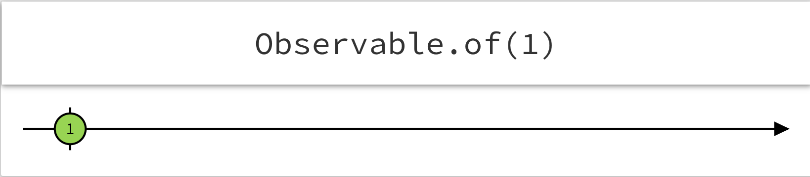

```swift
Observable.of("가", "나", "다", "라")
    .subscribe { (event) in print(event) }
    .disposed(by: self.disposeBag)
```

#### deferred

lazy initialze Observable 생성자. subscribe가 발생할때 Observable이 생성된다.

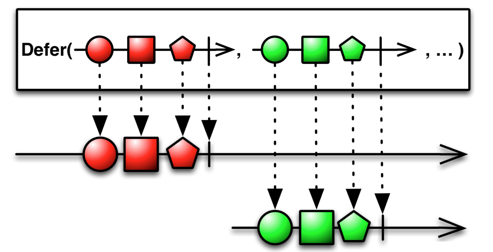

```swift
Observable.deferred({ Observable.just("RxSwift deferred 테스트") })
    .subscribe { (event) in print(event) }
    .disposed(by: self.disposeBag)
```

#### repeatElement

설장한 element를 반복적으로 이벤트를 발생한다.

```swift
Observable.repeatElement("repeat test")
    .subscribe { (event) in print(event) }
    .disposed(by: self.disposeBag)
```

#### range

설정한 Range내의 이벤트를 발생한다.

```swift
Observable.range(start: 10, count: 20)
    .subscribe { (event) in print(event) }
    .disposed(by: self.disposeBag)
```


## 2.Subject

> Subject는 Imperative eventing로 어떤 이벤트를 발생 하고 싶을때. 얼마나 많은 객체에게 그 이벤트를 구독하는지 중요하지 않다. 원하는 이벤트를 subscription(observer) 존재 여부와 관계없이 이벤트를 발행 할 수 있다.

#### AsyncSubject

Complete 될때까지 이벤트는 발생되지 않으며, complete가 되면 마지막 이벤트를 발생하고 종료된다.

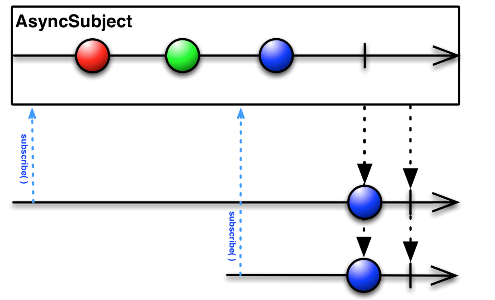

에러로 종료되면 마지막 이벤트 전달 없이 에러만 발생한다.

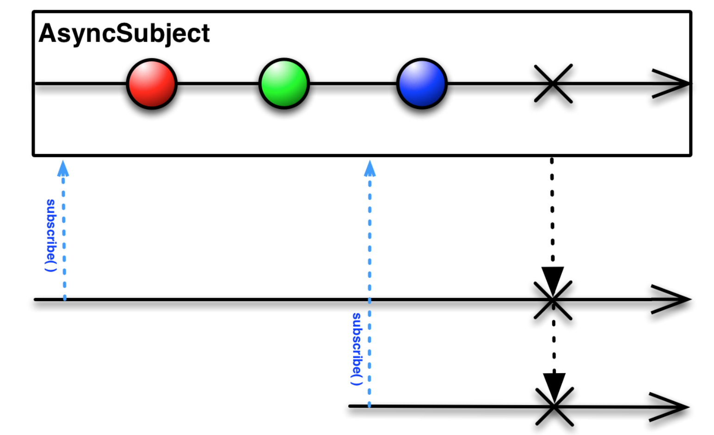

```swift
let asyncSubject = AsyncSubject<Int>()
asyncSubject
    .subscribe({ print($0) })
    .disposed(by: self.disposeBag)

asyncSubject.on(.next(1))
asyncSubject.on(.next(2))
asyncSubject.on(.next(3)) // 마지막 이벤트
asyncSubject.on(.completed)
//asyncSubject.on(.error(NSError(domain: "err", code: 404, userInfo: nil)))
// 에러로 종료되면 마지막 이벤트 전달 없이 에러만 발생한다.
```

#### PublishSubject

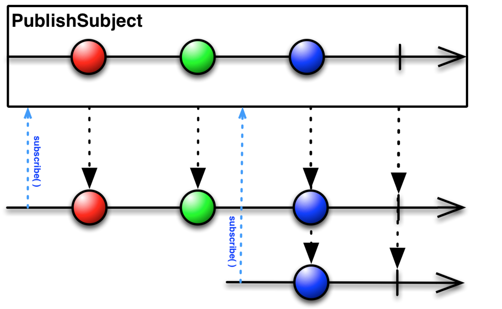

소스 Observable이 오류 때문에 종료되면 아무런 항목도 배출하지 않고 소스 Observable에서 발생한 오류를 그대로 전달한다.

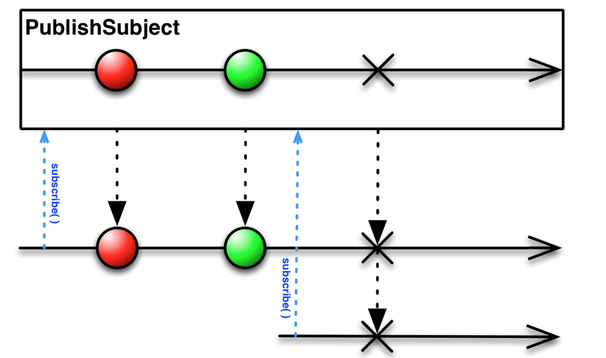

subscribe 된 시점 이후부터 발생한 이벤트를 전달한다. subscribe 되기 이전의 이번트는 전달하지 않는다.

```swift
let publishSubject = PublishSubject<String>()
publishSubject.onNext("publish 1")
publishSubject
    .subscribe({ print("1_\($0)") })
    .disposed(by: self.disposeBag)
publishSubject.onNext("publish 2")
publishSubject.onNext("publish 3")
publishSubject
    .subscribe({ print("2_\($0)") })
    .disposed(by: self.disposeBag)
publishSubject.onNext("publish 4")
publishSubject.onNext("publish 5")
```

#### BehaviorSubject

초기값을 지닌 subject이다. subscribe가 발생하면 현재 저장된 값을 이벤트로 전달하고 마지막 이벤트값을 저장하고 있다.

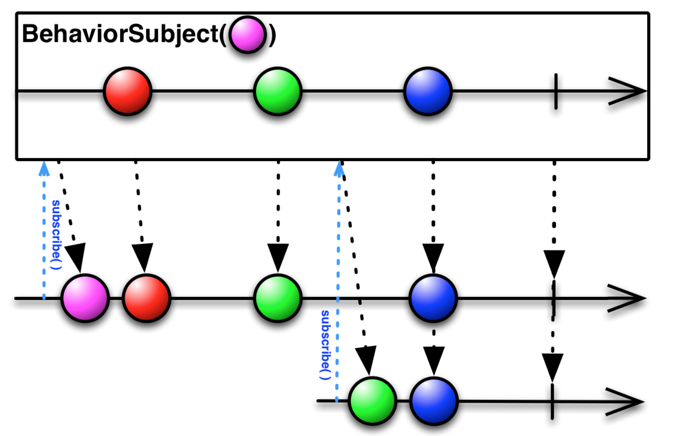

오류 때문에 종료되면 BehaviorSubject는 아무런 항목도 배출하지 않고 소스 Observable에서 발생한 오류를 그대로 전달한다.

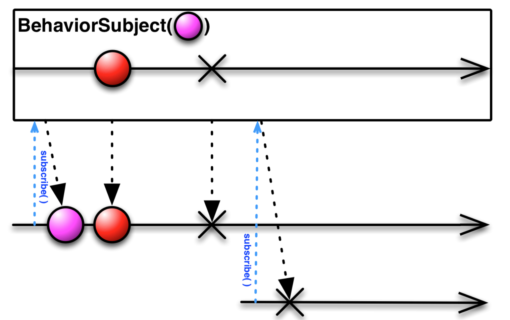

```swift
let behaviorSubject = BehaviorSubject<String>(value: "behavior init")
behaviorSubject
    .subscribe({ print($0) })
    .disposed(by: self.disposeBag)
behaviorSubject.onNext("behavior 1")
behaviorSubject.onNext("behavior 2")
behaviorSubject
    .subscribe({ print($0) })
    .disposed(by: self.disposeBag)
behaviorSubject.onNext("behavior 3")
behaviorSubject.onNext("behavior 4")
```

#### ReplaySubject

n개의 이벤트를 저장하고 subscribe되는 시점과 상관없이 저장된 모든 이벤트를 전달한다.

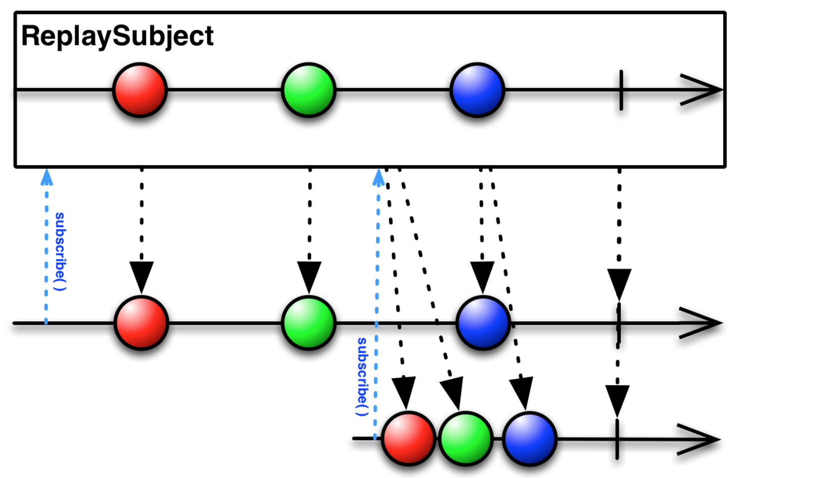

```swift
let replaySubject = ReplaySubject<String>.create(bufferSize: 3) // createUnbounded() 모든 이벤트가 전달된다.
replaySubject.onNext("replay 1")
replaySubject.onNext("replay 2")
replaySubject.onNext("replay 3")
replaySubject.onNext("replay 4")
replaySubject
    .subscribe({ print($0) })
    .disposed(by: self.disposeBag)
replaySubject.onNext("replay 5")
replaySubject.onNext("replay 6")
replaySubject.onNext("replay 7")
```

## 3.ObservableSynthesis

> Observable의 결합은 연결고리가 있느 몇가지 이벤트들을 같이 처리해야 할때 사용할수 있다.

#### combineLatest

두 Observable 의 각각의 이벤트가 발생할 때 두 Observable의 마지막 이벤트들을 묶어서 전달한다. 두 이벤트의 타입은 달라도 된다.

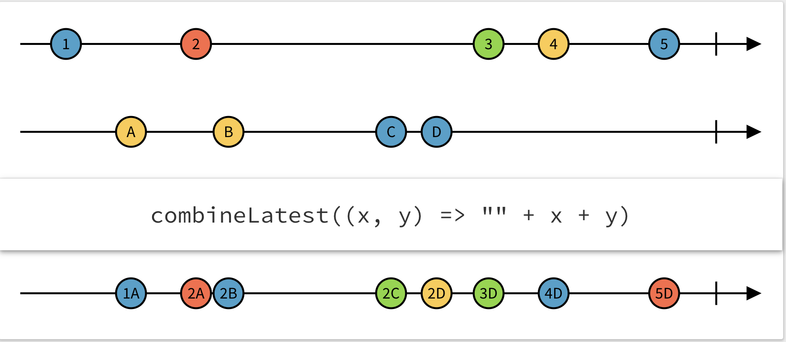

```swift
let combineFirst = Observable.from(["1", "2", "3"])
let combineSecond = Observable.from(["A", "B", "C", "D"])
Observable.combineLatest(combineFirst, combineSecond) { (first, second) in
    return (first, second)
    }.subscribe({ print("combineLatest \($0)") })
    .disposed(by: self.disposeBag)
```

```swift
combineLatest next(("1", "A"))
combineLatest next(("2", "A"))
combineLatest next(("2", "B"))
combineLatest next(("3", "B"))
combineLatest next(("3", "C"))
combineLatest next(("3", "D"))
combineLatest completed
```

#### withLatestFrom

두개의 Observable 을 합성하지만, 한쪽 Observable의 이벤트가 발생할때에 합성해주는 메서드이다. 합성할 다른쪽 이벤트가 없다면 이벤트는 스킵된다.

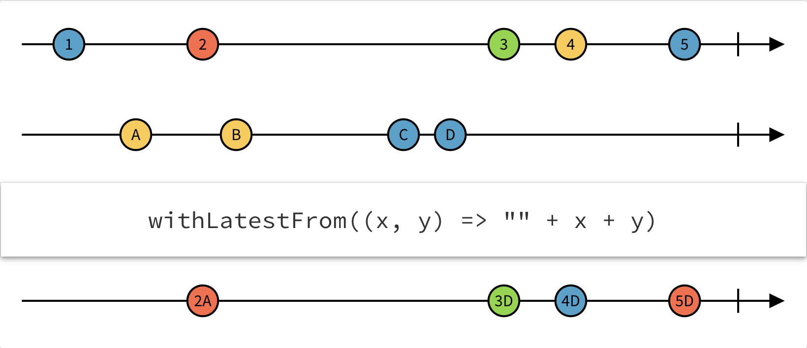

```swift
let latestFromFirst = Observable<Int>.interval(2, scheduler: MainScheduler.instance).take(6)
    .map{ ["A", "B", "C", "", "", "D"][$0] }
    .filter{ !$0.isEmpty }

Observable<Int>.interval(1, scheduler: MainScheduler.instance)
    .take(12)
    .map({ "\($0)" })
    .withLatestFrom(latestFromFirst, resultSelector: { (first, second) in
        return (first, second)
    }).subscribe({ print($0) })
    .disposed(by: self.disposeBag)
```

```swift
next(("1", "A"))
next(("2", "A"))
next(("3", "B"))
next(("4", "B"))
next(("5", "C"))
next(("6", "C"))
next(("7", "C"))
next(("8", "C"))
next(("9", "C"))
next(("10", "C"))
next(("11", "D"))
completed
```

#### merge

merge는 같은 타입의 이벤트를 발생하는 Observable을 합성하는 함수이며, 각각의 이벤트를 모두 수신할 수 있다.

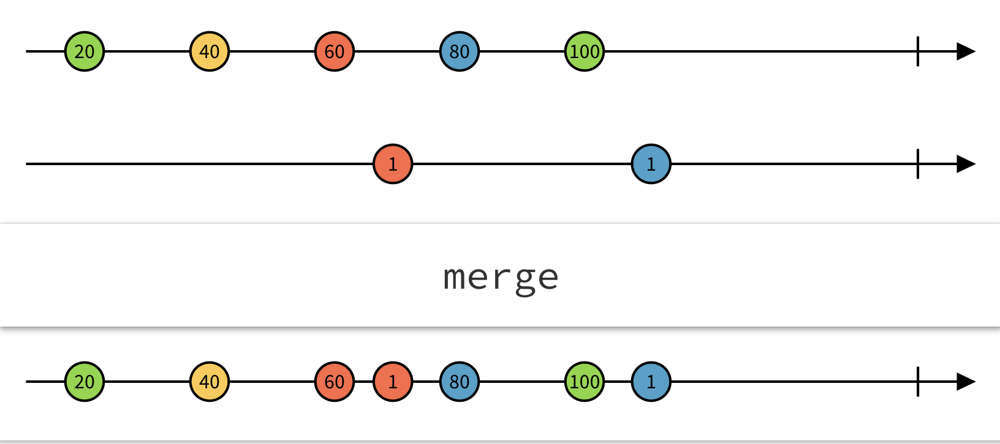

```swift
let mergeFirst = Observable<Int>.interval(1, scheduler: MainScheduler.instance).take(3)
    .map({ "mergeFirst: \($0)" })
let mergeSecond = Observable<Int>.interval(2, scheduler: MainScheduler.instance).take(2)
    .map({ "mergeSecond: \($0)" })
Observable.of(mergeFirst, mergeSecond).merge().subscribe { event in
    print(event)
    }.disposed(by: self.disposeBag)
```

```swift
next(mergeFirst: 0)
next(mergeFirst: 1)
next(mergeSecond: 0)
next(mergeFirst: 2)
next(mergeSecond: 1)
completed
```

#### switchLatest

switchLatest는 observable을 switch 할 수 있는 observable이다.
이벤트를 수신하고 싶은 observable로 바꾸면 해당 이벤트가 발생하는 것을 수신할 수 있다.

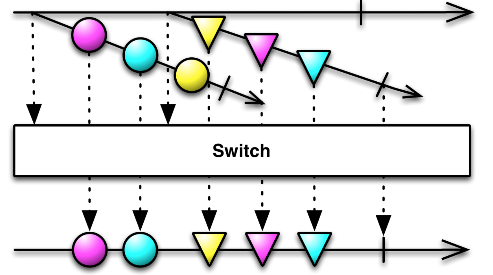

```swift
let first = PublishSubject<String>()
let second = PublishSubject<String>()
let switchTest = BehaviorSubject<Observable<String>>(value: first)
switchTest.switchLatest().subscribe { (event) in
    print(event)
    }.disposed(by: self.disposeBag)
first.onNext("A1")
second.onNext("B1")
switchTest.onNext(second)
first.onNext("A2")
second.onNext("B2")
second.onNext("B3")
first.onNext("A3")
first.onNext("A4")
second.onNext("B4")
second.onNext("B5")
```

```swift
next(A1)
next(B2)
next(B3)
next(B4)
next(B5)
```


#### zip

zip으로 두개의 Observable를 합친다.

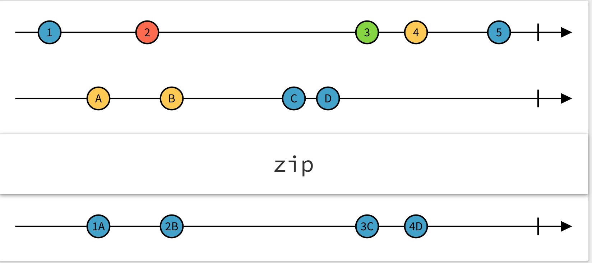

```swift
Observable.zip(Observable.from([1, 2, 3, 4]), Observable.of("A", "B", "C")) { (first, second) in
    return "\(first)\(second)"
    }.subscribe({ print($0) })
    .disposed(by: self.disposeBag)
```

```swift
next(1A)
next(2B)
next(3C)
completed
```

#### concat

두개 이상의 Observable를 직렬로 연결한다. 하나의 Observable가 이벤트를 전달 완료 후 그 다음 Observable의 이벤트를 전달한다.

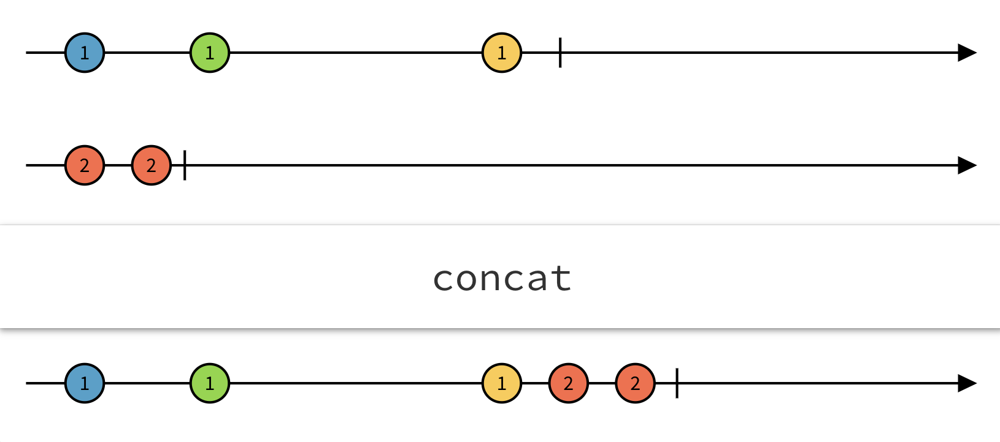

```swift
Observable<Int>.interval(1, scheduler: MainScheduler.instance)
    .map{ "first: \($0)" }
    .take(3)
    .concat(Observable<Int>.interval(0.5, scheduler: MainScheduler.instance).map{ "second: \($0)" }.take(4))
    .subscribe({ print($0) })
    .disposed(by: self.disposeBag)
```

```swift
next(first: 0)
next(first: 1)
next(first: 2)
next(second: 0)
next(second: 1)
next(second: 2)
next(second: 3)
completed
```

#### amb

맨 먼저발생한 Observable의 이벤트만을 사용한다.

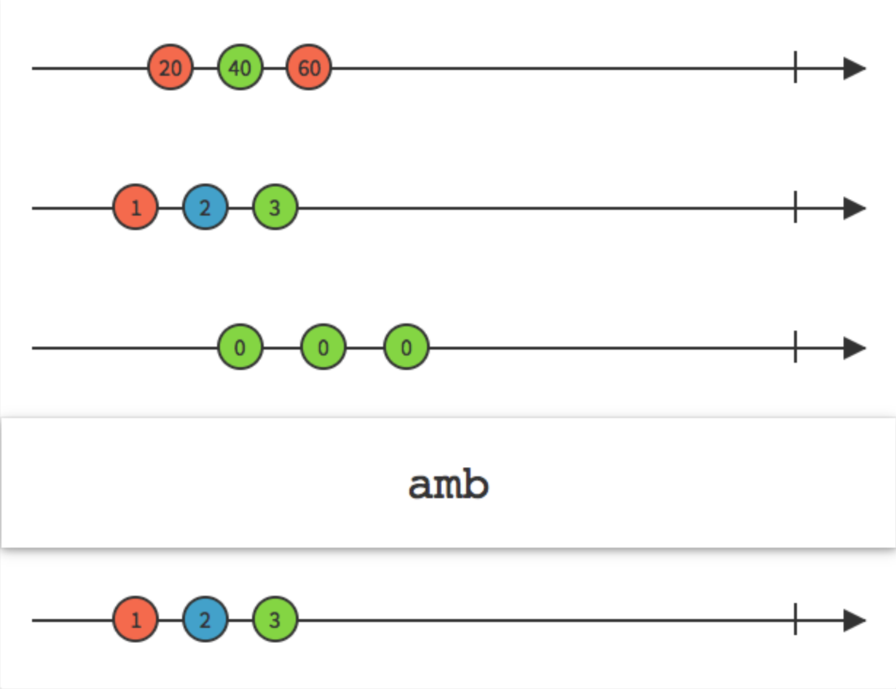

```swift
let first = Observable<Int>.interval(1, scheduler: MainScheduler.instance)
    .map{ "first: \($0)" }
    .take(3)
let second = Observable<Int>.interval(0.5, scheduler: MainScheduler.instance)
    .map{ "second: \($0)" }
    .take(3)
let third = Observable<Int>.interval(1.1, scheduler: MainScheduler.instance)
    .map{ "third: \($0)" }
    .take(3)
first.amb(second).amb(third)
    .subscribe({ print($0) })
    .disposed(by: self.disposeBag)
```

```swift
next(second: 0)
next(second: 1)
next(second: 2)
completed
```

#### startWith

처음 이벤트를 넣어줄 수 있다.

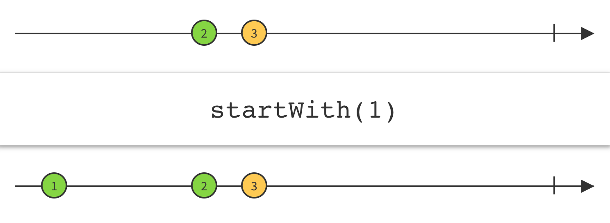

```swift
Observable.from([1, 2, 3, 4, 5])
    .startWith(9, 8, 7)
    .subscribe({ print($0) })
    .disposed(by: self.disposeBag)
```

```swift
next(9)
next(8)
next(7)
next(1)
next(2)
next(3)
next(4)
next(5)
completed
```

## 4.ErrorHandling

> Error이 났을때 감지하는 catchError 메서드와 다시 시도하는 retry, 일정 시간동안 이벤트가 오지 않으면 timerout을 할수있다.


#### catchError

에러가 발생되었을때 onError로 종료되지 않고 이벤트를 발생하고 onComplete 될수 있게 한다

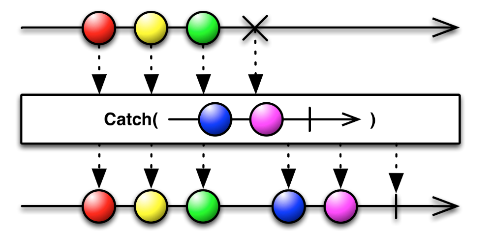

```swift
Observable<String>.create{ observer in
    for count in 1...3 {
        observer.onNext("\(count)")
    }
    observer.onError(NSError(domain: "error!", code: 404, userInfo: nil))
    return Disposables.create {
        print("dispose!")
    }
    }.catchError { (error) -> Observable<String> in
        return Observable.of("close1", "close2")
    }.subscribe({ print($0) })
    .disposed(by: self.disposeBag)
```

```swift
next(1)
next(2)
next(3)
dispose!
next(close1)
next(close2)
completed
```

#### catchErrorJustReturn

subscribe에서 에러를 감지하는 것이 아닌, Observable에서 에러에 대한 기본 이벤트를 설정한다.

```swift
Observable<String>.create{ observer in
    [1, 2, 3].forEach({ observer.on(.next("\($0)")) })
    observer.on(.error(NSError(domain: "error!", code: 404, userInfo: nil)))
    return Disposables.create {
        print("dispose!")
    }
    }.catchErrorJustReturn("End")
    .subscribe({ print($0) })
    .disposed(by: self.disposeBag)
```

```swift
next(1)
next(2)
next(3)
next(End)
completed
dispose!
```

#### retry

에러가 발생했을때 성공을 기대하며 Observable을 다시 시도한다. maxAttemptCount를 통해 재시도 횟수를 지정한다. 2를 주면 재시도를 1번 한다.

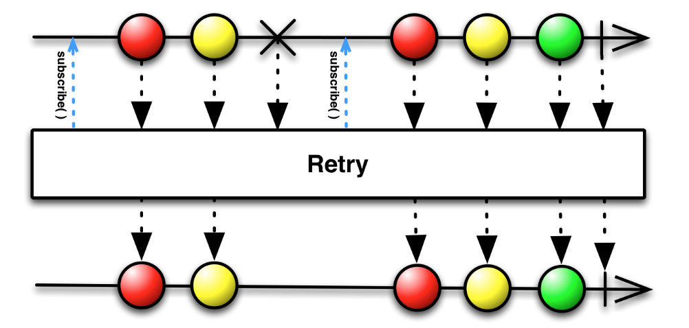

```swift
var isFirst = true
Observable<String>.create { observer in
    observer.onNext("1")
    observer.onNext("2")
    if isFirst {
        observer.onError(NSError(domain: "Error!", code: 404, userInfo: nil))
    } else {
        observer.on(.completed)
    }
    isFirst = false
    return Disposables.create()
    }.retry(2)
    .subscribe({ print($0) })
    .disposed(by: self.disposeBag)
```

```swift
next(1)
next(2)
next(1)
next(2)
completed
```

#### retryWhen

retry 하는 시점을 지정할수 있다. 재시도는 한번만 수행한다.

```swift
Observable<String>.create { observer in
    observer.on(.next("1"))
    observer.on(.next("2"))
    observer.onError(NSError(domain: "Error!", code: 404, userInfo: nil))
    return Disposables.create()
    }.retryWhen { (_) -> Observable<Int> in
        return Observable<Int>.timer(3, scheduler: MainScheduler.asyncInstance)
    }.subscribe({ print($0) })
    .disposed(by: self.disposeBag)
```

```swift
next(1)
next(2)

next(1)
next(2)
completed
```

#### timeout

이벤트가 일정시간동안 발생하지 않으면 오류를 발생시킨다.

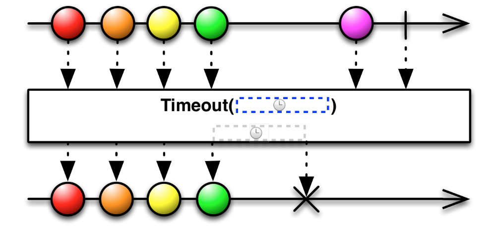

```swift
Observable<Int>.create { observer in
    let timer = DispatchSource.makeTimerSource(queue: DispatchQueue.global())
    timer.schedule(deadline: .now() + 1, repeating: 1)
    let cancel = Disposables.create {
        timer.cancel()
    }
    var next = 0
    timer.setEventHandler(handler: {
        if cancel.isDisposed { return }
        if next < 3 {
            observer.onNext(next)
            next += 1
        }
    })
    timer.resume()
    return cancel
    }.timeout(2, scheduler: MainScheduler.instance)
    .subscribe({ print($0) })
    .disposed(by: self.disposeBag)
```

```swift
next(0)
next(1)
next(2)
error(Sequence timeout.)
```


참고 블로그<br/>
[RxSwift 알아보기](https://brunch.co.kr/@tilltue)
