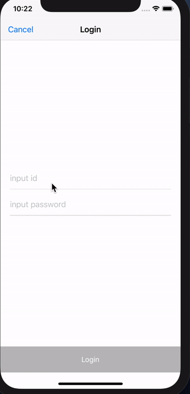

# RxSwiftExample
RxSwift 😵

### Download

git clone https://github.com/pikachu987/RxSwiftExample.git
 
or
 
[Zip Download](https://github.com/pikachu987/RxSwiftExample/archive/master.zip)

### [1.BasicExample](https://github.com/pikachu987/RxSwiftExample/tree/master/1.BasicExample)

RxSwift의 기본 문법 정리 
(Basic syntax of RxSwift)

### [2.SimpleProject](https://github.com/pikachu987/RxSwiftExample/tree/master/2.SimpleProject)

 Github의 Trending API를 사용하여 데이터를 UITableView에 보여주기 
 (Show data in UITableView using Github Trending API)

 1. MVC
 2. MVC+Rx
 3. MVVM+Rx
 4. MVVM+Rx+InputOutput
 5. MVVM+Rx+InputOutput+Coordinator

 5개의 프로젝트를 비교 
 (Compare 5 projects)

### [3.SomeProject](https://github.com/pikachu987/RxSwiftExample/tree/master/3.SomeProject)

Github의 Trending API과 MVVM+Rx+InputOutput+Coordinator를 이용한 몇가지 예제 
(Github Trending API and MVVM + Rx + InputOutput + Coordinator Some examples using)

1. UIRefreshControl을 이용하여 PullToRefresh 사용 (Use PullToRefresh with UIRefreshControl)
2. UITableView의 LoadMore를 사용하여 페이징 (Paging with UITableView LoadMore)
3. UITableViewCell을 select하여 다음 페이지로 이동 (Select UITableViewCell to go to next page)

### [4.GithubProject](https://github.com/pikachu987/RxSwiftExample/tree/master/4.GithubProject)

Github API를 사용하여 Github 프로젝트 만들기 
(Create a Github project using the Github API) 
Trending, Search, Login, MyRepositories, Stars, Followers, Followings 

|Trending|Login|
|---|---|
|||

|Search|PageViewController|
|---|---|
|||

이 repository가 도움이 되었다면 Star를 눌러주세요. 
(If this repository is helpful to you, please press Star.)
